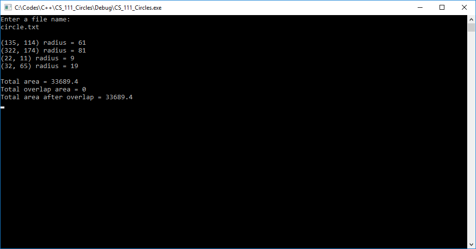
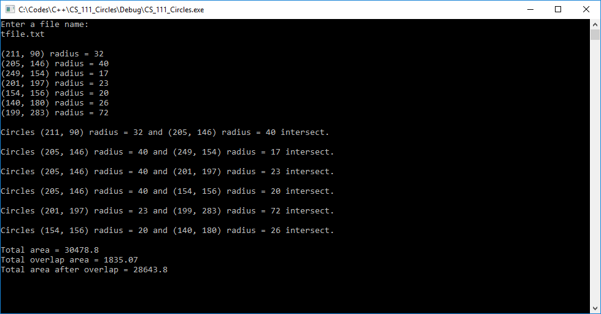

# Circles (C++)
Given a file containing circle data, the program processes the file to see if the circles overlap. If they do, then the total overlapped area is calculated along with the total area.

* 4 non-overlapping circles

* 7 circles, some overlapping
